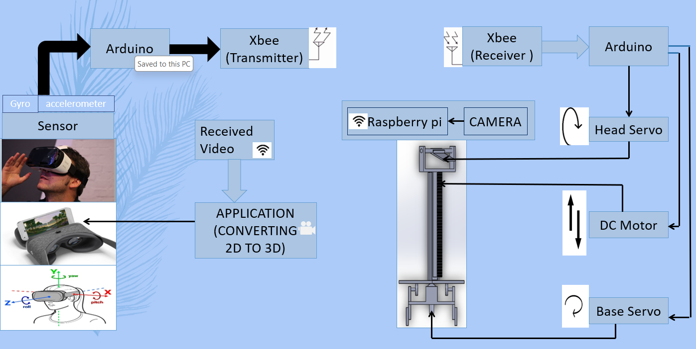

# VR-based-Surveillance-System

##Overview
This project implements a Virtual Reality (VR)-based surveillance system using Arduino, Raspberry Pi, MPU-6050 motion-tracking sensors, Xbee radio transmission, and servo motors. The system allows users to control a camera's movement remotely using motion detection sensors mounted on VR glasses.

##Features
*  Motion Tracking: Calibrated MPU-6050 sensors mounted on VR glasses detect the movement of the user's head.
*  Radio Transmission: Utilizes Xbee for wireless transmission of movement data from the VR glasses to the camera-end.
*  Camera Control: Arduino is programmed to control the movement of the camera through servo motors, mimicking the user's head movement.
*  Video Streaming: Integrates a camera with Raspberry Pi to upload video to a web server.
*  Mobile Access: The streamed video can be accessed on smartphones, aiding users in deciding where to look next.

##Hardware Setup:

*  Mount MPU-6050 sensors on VR glasses.
*  Connect Xbee modules for wireless communication.
*  Interface servo motors with Arduino for camera control.
*  Connect a camera with Raspberry Pi.

##Software Setup:

*  Upload the provided Arduino code 'TX_side.ino' to the sensor Arduino on the VR side.
*  Upload the provided Arduino code 'Reciver_Side.ino' to the receiver Arduino.
*  Configure Raspberry Pi to stream video to a web server.

##Run the System:

*  Power on the VR glasses and camera system.
*  Access the web server on smartphones to view the streamed video.
*  Move your head with VR glasses to control the camera's movement remotely.

##Usage Scenario

The VR-based surveillance system finds applications in various scenarios, including:

*  Remote monitoring of environments without human presence.
*  Surveillance in hazardous or inaccessible areas.
*  Live streaming of events or gatherings for remote viewers.

##Hardware Components
*  Arduino: Used for sensor interfacing and servo motor control.
*  Raspberry Pi: Interfaces with the camera for video streaming.
*  MPU-6050: Motion-tracking sensors mounted on VR glasses.
*  Xbee: Radio modules for wireless transmission of sensor data.

##Future Enhancements
*  Integration of advanced image processing algorithms for object detection and tracking.
*  Enhancement of user interface for better control and monitoring.
